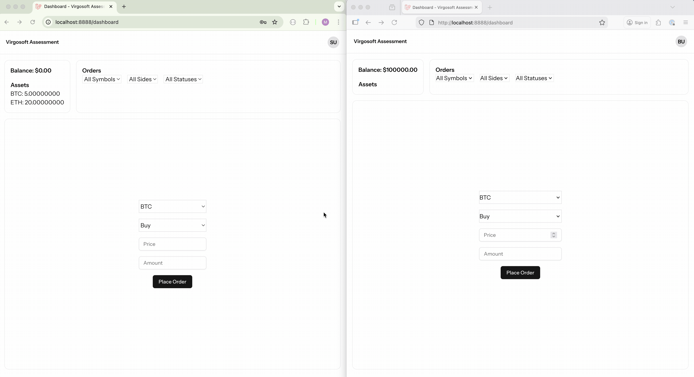

# Usage

To set up and run the project, follow these steps:

### 1. Install Docker(Optional if you have it installed already)

Make sure you have Docker installed on your machine. You can download it from [here](https://www.docker.com/products/docker-desktop).

### 2. Clone the Repository

```bash
git clone git@github.com:liucf/exchange_app.git
cd exchange_app
```

### 3. Copy the Example Environment File

```bash
cp .env.example .env
```

### 4. Install Dependencies and start queue worker

```bash
composer install
```

### 5. Start the Application Using Sail
```bash
sail up -d
```

### 6. Set Up the Environment Variables
- Run `sail artisan key:generate` to generate the application key.
- Create a pusher project and set the following variables in your `.env` file:
    ```
    PUSHER_APP_ID=your_app_id
    PUSHER_APP_KEY=your_app_key
    PUSHER_APP_SECRET=your_app_secret
    PUSHER_APP_CLUSTER=your_app_cluster
    ```
### 7. build front-end assets and start queue worker
```bash
sail npm install
sail npm run build
```

### 8. Run Migrations and Seed the Database
```bash
sail artisan migrate --seed
```

### 9. Start the Queue Worker
```bash
sail artisan queue:work
```

### 10. Access the Application

Open your web browser and navigate to `http://localhost:8888` to access the application.

### 11. Test functionality
Open two different browser(for example: chrome and firefox)

- Browser 1: Access `http://localhost:8888`, login with `sell@example.com` and password `password`
- Browser 2: Access `http://localhost:8888`, login with `buy@example.com` and password `password`
<p align="center">
  
</p>

### 12. Running Tests

To run the test suite, use the following command:

```bash
sail artisan test
```
